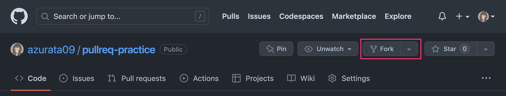
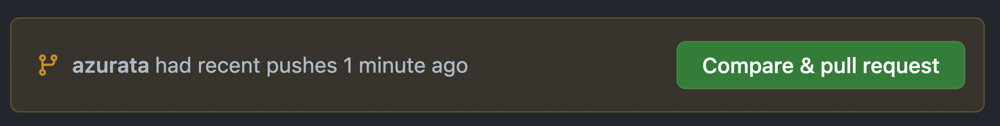
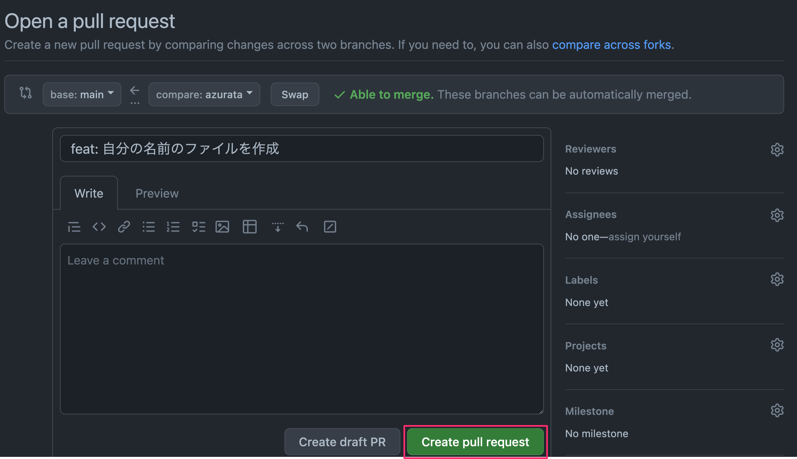

# pullreq-practice

## How to

1. `fork`する
2. `fork`後のリポジトリを`clone`する
    - 
3. 自分の名前のファイルを作る
    - 例: `azurata`, `catherine`, `sumeshi`, etc...
4. `add`/`commit`
5. `push`
6. プルリクを作成
    - 
    - 
